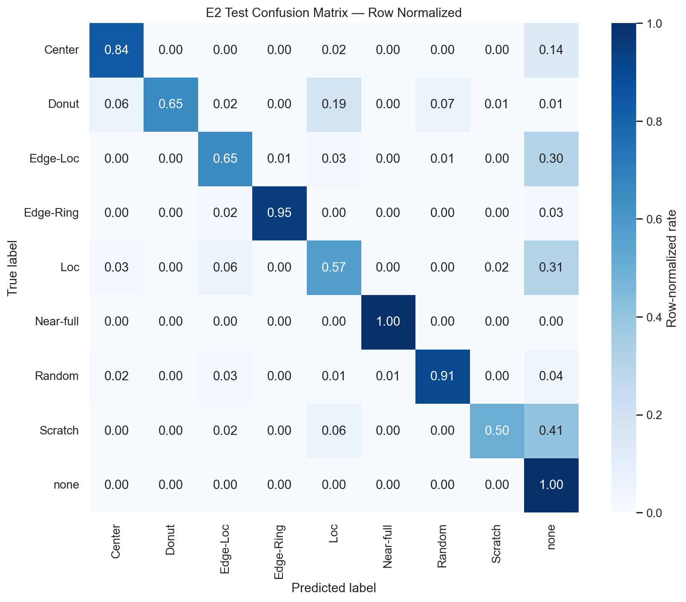
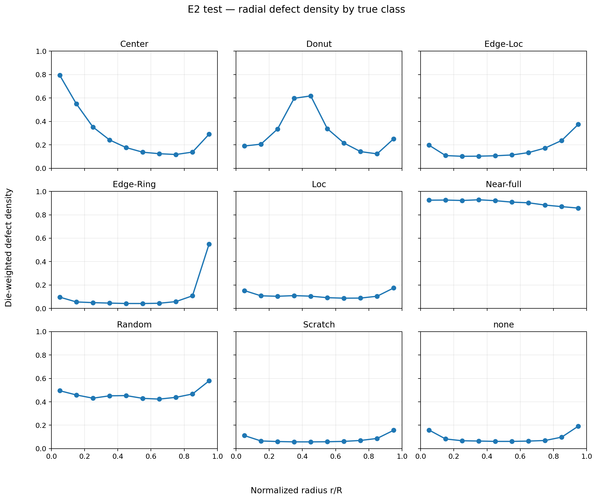
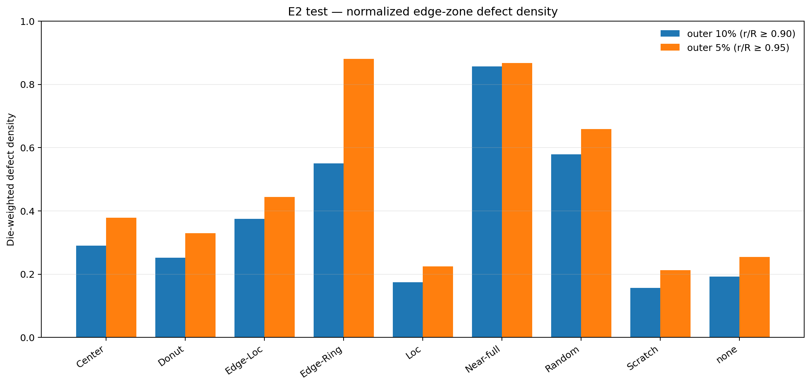

# WM-811K WaferMap Lab

공개 웨이퍼 맵 데이터셋 WM-811K를 8개 불량 패턴과 패턴 없음 라벨 `none`, 합쳐서 9개 클래스로 분류하는 프로젝트다. 출발점은 강의 실습이었는데, 실습 코드대로 웨이퍼를 무작위로 나누면 같은 로트가 학습과 평가에 함께 들어가 성능이 실제보다 높게 나온다. 그래서 분할을 로트 단위로 다시 묶고, 클래스 불균형에 맞게 평가 지표를 macro F1로 바꾸고, 신뢰구간은 로트를 단위로 다시 뽑는 클러스터 부트스트랩 2,000회로 산출했다.

검증 데이터에서 가장 높은 macro F1을 낸 2채널 CNN인 E2를 확정한 뒤 테스트는 한 번만 수행했다. 결과는 macro F1 0.8349, 95% 신뢰구간 [0.8158, 0.8494]다.

## 로트 단위 분할

웨이퍼를 무작위로 섞어 나누면 학습에서 본 로트가 평가에도 나타난다. 같은 로트의 웨이퍼는 공정 조건과 결함 특성을 공유할 수 있으므로, 이렇게 나누면 성능이 과대평가될 수 있다. 그래서 로트는 통째로 한 분할에만 넣었고, 분할 간 로트 교집합은 0, 세 분할 모두 9개 클래스를 갖도록 했다. 분할 함수 `find_group_split`은 두 조건 중 하나라도 어긴 후보를 버리고, 통과하는 후보가 하나도 없으면 학습을 시작하기 전에 멈춘다.

지켜야 할 규칙이 두 가지 더 있다. 모델 선택에는 학습과 검증 분할만 쓴다는 것, 그리고 테스트는 설정을 확정한 뒤 한 번만 본다는 것이다. 둘 다 도구가 강제한다. `--stage test`는 설정 파일이 지정한 실험에만 열리고, 테스트를 이미 확정한 디렉터리는 테스트든 검증이든 재실행을 거부한다. 다만 설정 파일 자체를 고쳐 가며 실험을 하나씩 테스트하는 것까지 막지는 못하므로, 그것만은 사용자가 지켜야 한다.


## 실험

실험은 네 가지다. E0은 학습 분할에서 가장 많은 클래스만 답하는 기준선인데 지금 분할에서 그 클래스는 `none`이고, E1은 웨이퍼 맵의 `0/1/2` 값을 채널 하나로 그대로 넣는 CNN이다. E2는 다이가 있는 자리를 표시한 die mask와 결함 다이만 표시한 defect mask를 채널 둘로 나눠 넣는 CNN이고, E3는 E2와 같은 입력에 클래스 빈도의 역수를 가중치로 쓰는 교차 엔트로피 손실을 추가한 것이다.

| 실험 | 입력과 손실 | 최적 epoch | macro F1 | balanced accuracy |
|---|---|---:|---:|---:|
| E0 | 다수 클래스 예측 | - | 0.1023 | 0.1111 |
| E1 | 1채널 `0/1/2`, 일반 CE | 26 | 0.8478 | 0.8104 |
| **E2** | **2채널 `[die, defect]`, 일반 CE** | **18** | **0.8496** | 0.8025 |
| E3 | 2채널, 역빈도 가중 CE | 23 | 0.8355 | **0.8762** |

macro F1은 E2가 가장 높지만 E1과의 차이가 0.0018뿐이라, 이 수치만으로 2채널 입력이 낫다고 말하기는 어렵다. 클래스별 재현율의 평균인 balanced accuracy에서는 오히려 E3가 앞서는데, E3는 희소 클래스를 더 많이 잡아내는 대신 정밀도가 떨어졌고 가중치의 최대/최소 비가 1,038.8배까지 벌어지므로 그 값만 보고 고를 수는 없었다.

### P0 seed 반복 검증과 P1 가중치 완화

학습 한 번으로 0.0018을 판정할 수는 없으니, P0에서는 같은 분할에서 seed 5개로 E1, E2, E3를 반복했다. E2−E1의 macro F1 차이는 +0.0015 ± 0.0024로 seed 변동보다 작았고, 2채널이 낫다는 가설을 뒷받침할 근거는 여기서도 얻지 못했다. 반면 E3의 Scratch, Loc, Edge-Loc 재현율 상승과 정밀도 하락은 seed를 바꿔도 반복해서 나타났다.

P1에서는 역빈도 가중치가 너무 강하다고 판단해 두 가지 방식으로 완화해 비교했다.

| 실험 | 가중치 | 검증 macro F1 평균 ± 표준편차 | 판정 |
|---|---|---:|---|
| E3b | 제곱근 역빈도 | **0.8578 ± 0.0066** | P1 선도 후보 |
| E3c | 역빈도 + 32:1 상한 | 0.8529 ± 0.0138 | Edge-Loc 재현율 상승, 정밀도 하락 |

평균이 높고 seed 간 편차도 작아 E3b를 P1의 선도 후보로 정했다. 여기까지는 모두 검증 데이터 안에서 끝냈고, 테스트는 실행하지 않았으며 이미 확정된 E2의 테스트 결과도 그대로 두었다.

### 테스트

| 지표 | 결과 |
|---|---:|
| macro F1 | **0.8349** |
| 로트 클러스터 부트스트랩 95% CI (2,000회) | **[0.8158, 0.8494]** |
| balanced accuracy | **0.7857** |
| 테스트 표본 / 로트 | 34,772 / 2,159 |



오분류는 한쪽으로 치우쳐 있다. Scratch의 41%, Loc의 31%, Edge-Loc의 30%가 `none`으로 잘못 분류되고, Donut은 19%가 Loc으로 잘못 분류된다. Near-full은 재현율 1.0이지만 테스트 표본이 32개뿐이라 일반화 근거로 쓰지 않는다. 그래서 개선 대상은 Scratch, Loc, Edge-Loc, Donut으로 확정했다.

### P2 Grad-CAM 해석

P2에서는 모델이 어느 영역을 근거로 판단했는지 보려고 확정된 E2의 마지막 합성곱 층에 Grad-CAM을 적용했다. 절차는 결과를 내기 전에 [`reports/P2_INTERPRETABILITY.md`](reports/P2_INTERPRETABILITY.md) 1장에 사전 등록했고, 검증 분할에서 저장된 예측과 재추론 결과가 일치하는지, CAM의 크기와 값 범위와 재현성, mask 정렬 검사가 통과하는지 먼저 확인한 뒤에 같은 절차를 테스트 사례에 적용했다.

Grad-CAM으로 얻은 것은 사후 진단이지 인과 설명도, 새로운 성능 근거도 아니다. 다이 영역 안에 놓인 CAM 합 가운데 실제 결함 다이 위에 놓인 비율을 실제 클래스 CAM으로 구하고, 그 중앙값을 맞힌 사례와 `none`으로 놓친 사례에서 비교하면 차이는 Scratch +0.0290(로트 부트스트랩 95% CI [0.0071, 0.0437]), Loc +0.0421([0.0105, 0.0759])이었다. 이는 놓친 사례에서 모델이 결함 다이 부근의 단서를 덜 잡았다는 해석과 일치하지만, 마지막 합성곱 특징 맵의 해상도가 낮고 Grad-CAM 자체가 근사이므로 픽셀 단위의 위치 설명으로 읽어서는 안 된다. 다만 mask를 팽창시켜 경계 부근까지 넣고 계산하면 신뢰구간이 0을 포함하므로, 같은 결론을 경계 부근까지 넓힐 수는 없다. P1은 다시 돌리지 않았고 E3b와 E3c는 테스트 데이터에서 평가하지 않았다.

## 결함 위치의 공간 분포

데이터에는 웨이퍼의 실제 직경도, 장비 좌표도, 방향 기준점인 notch도 없다. 그래서 각도 분석은 하지 않았고, 물리 단위 대신 중심에서 가장 먼 다이를 1로 두는 정규화 반경 `r/R` 위에서 클래스별 결함 밀도를 확인했다. 최외곽 5%와 10% 영역은 따로 떼어 비교했다.





여기서 나온 공간 패턴은 공정이나 장비를 점검할 가설을 세우는 데까지만 쓴다.

## 공개 범위와 대시보드

이 저장소는 개발용 저장소의 현재 파일 상태를 커밋 하나로 담은 공개판이다. 공개 뒤 만들어진 clone이나 fork는 회수되지 않으므로, 공개 전에 추적 파일 전체를 확인해 비밀값과 식별자가 남아 있는지 점검한다. 원본 pickle, 체크포인트, 웨이퍼별 예측 CSV, P2 사례 목록과 로트 식별자는 저장소에 올리지 않고 별도 웹사이트나 블로그도 배포하지 않는다. 코드와 보고서, 집계 그림이 전부 여기 있다.

Streamlit 대시보드는 원본 데이터나 모델을 다시 불러오지 않고 저장된 결과 파일만 읽는다. 공개 저장소에서 뺀 사례 패널은 `scripts/analyze_cases_and_spatial.py`와 `scripts/run_p2_interpretability.py`로 로컬에서 만든 뒤 실행하면 된다.

```powershell
Set-Location "<PROJECT_DIR>\project1"
.\.venv\Scripts\streamlit.exe run .\app.py
```

`http://localhost:8501`에서 E0~E3 검증 비교, 선택된 실험의 클래스별 성능과 혼동 행렬, 로컬에서 재생성한 정답과 오답 사례, 반경과 가장자리 분석, 분할과 평가 설계를 볼 수 있다.

## 재현

### 데이터

신뢰할 수 있는 배포처에서 받은 `LSWMD.pkl`을 `data/LSWMD.pkl`에 둔다. 용량과 재배포 조건 때문에 Git에는 넣지 않았다. 분할 파일의 `source_row_id`는 분할을 만들 당시 프레임의 행 위치라서, 배포본이나 추출 방식이 달라 행 순서가 바뀌면 예측과 사례가 오류 없이 다른 웨이퍼에 붙는다. 그래서 학습과 사례 분석, 공간 분석은 데이터를 열기 전에 데이터 파일과 분할 파일의 해시를 `artifacts/splits.metadata.json`의 기록과 대조하고 다르면 중단하며, 학습은 분할을 병합한 직후 로트 교집합과 클래스 존재를 한 번 더 감사한다. P2 해석 스크립트는 같은 해시를 자체 목록에 고정해 두고 실제로 읽는 파일을 검사한다. pickle은 역직렬화만으로 코드가 실행되므로 출처가 불분명한 파일은 열지 않는다. 배포처, 라이선스, 다운로드 날짜, 파일 크기, SHA-256은 [`data/DATA_CARD.md`](data/DATA_CARD.md)에 적어 뒀다.

### 환경

검증한 조합은 Python 3.10.11, PyTorch 2.12.1+cu130, RTX 4080 SUPER다.

```powershell
Set-Location "<PROJECT_DIR>\project1"
powershell -ExecutionPolicy Bypass -File .\scripts\setup.ps1 `
  -InstallCudaTorch -InstallDev -InstallApp
.\.venv\Scripts\python.exe .\scripts\doctor.py --strict
```

CPU만 있다면 `-InstallCudaTorch` 자리에 `-InstallCpuTorch`를 넣는다.

### 분할과 학습

저장소에는 확정된 E2의 검증 결과와 테스트 결과가 `artifacts/E2`에 이미 들어 있다. 그래서 아래 명령 가운데 E2의 학습과 테스트는 그대로 실행하면 잠금에 걸려 멈추고, E2를 다시 돌리려면 `artifacts/E2` 디렉터리를 먼저 다른 곳으로 옮겨야 한다.

```powershell
# 로트 단위 분할 생성
.\.venv\Scripts\python.exe .\scripts\prepare_splits.py `
  --data .\data\LSWMD.pkl `
  --output .\artifacts\splits.csv

# E0~E3 학습과 검증
.\.venv\Scripts\python.exe .\scripts\run_experiment.py --experiment E0
.\.venv\Scripts\python.exe .\scripts\run_experiment.py --experiment E1
.\.venv\Scripts\python.exe .\scripts\run_experiment.py --experiment E2
.\.venv\Scripts\python.exe .\scripts\run_experiment.py --experiment E3

# 검증 결과로 확정한 E2의 테스트 1회 평가
.\.venv\Scripts\python.exe .\scripts\run_experiment.py `
  --experiment E2 --stage test --confirm-test
```

`--stage test`는 `configs/experiments.json`의 `final_selected_experiment`(지금은 `E2`)에만 열려 있다. 다른 실험으로 테스트를 시도하면 막히는데, 두 번째 실험을 테스트하는 순간 테스트 데이터가 모델 선택 기준으로 바뀌기 때문이다. 체크포인트를 다시 불러올 때도 분할 해시만 보지 않고 실험 이름, 설정, 라벨 인덱스, 시드를 전부 대조한다.

테스트를 확정한 디렉터리(`artifacts/E2/test_metrics.json`이 있는 상태)는 검증 재실행마저 거부한다. 재학습이 `best.pt`를 교체하면 보고된 수치를 만든 가중치가 사라져 결과를 되짚을 방법이 없어지기 때문이다. 재실행이 필요하면 디렉터리를 먼저 다른 곳으로 옮긴다. seed 반복 실행(`--seed N`)은 `artifacts/repeat/{실험}/seed{N}`에 따로 저장되니 이 잠금과 무관하다. E1~E3 계열처럼 체크포인트를 만드는 실험은 이후 실행부터 `*_metrics.json`에 그 수치를 만든 체크포인트의 해시 `checkpoint_sha256`을 함께 남긴다. E0은 학습 없이 다수 클래스만 답하는 기준선이라 체크포인트 자체가 없다. 이 기능보다 먼저 만들어진 산출물에는 해시가 없고, 그중 `artifacts/E2/test_metrics.json`의 체크포인트는 `scripts/run_p2_interpretability.py`가 해시를 고정해 두고 있다.

### 검사

```powershell
.\.venv\Scripts\python.exe -m ruff check .
.\.venv\Scripts\python.exe -m pytest
.\.venv\Scripts\python.exe .\scripts\smoke_test.py
```

### 웨이퍼 한 장 확인

집계 지표만으로는 모델이 무엇을 놓치는지 알 수 없어서, 웨이퍼 한 장을 골라 확정된 체크포인트로 그 자리에서 추론하고 세 패널로 그리는 `show_one_wafer.py`를 두었다. 패널은 원본 맵, 모델이 실제로 받는 64×64 입력, 예측 클래스에 대한 Grad-CAM 순서이고, 결함 다이는 CAM 위에 청록 윤곽으로 겹쳐 그리므로 모델이 결함 부근을 근거로 삼았는지 가늠할 수 있다. 다만 CAM은 해상도가 낮은 근사라서 다이 하나 단위의 위치 설명은 아니다.

```powershell
.\.venv\Scripts\python.exe .\scripts\show_one_wafer.py --true-label Scratch --seed 7
```

`--seed`를 바꾸면 다른 웨이퍼가 나올 수 있고, 실행할 때마다 재현 명령을 함께 출력하므로 다시 볼 사례는 `--source-row-id`로 다시 부를 수 있다. `--only-errors`는 오분류 사례만, `--split test`는 테스트 사례를 본다. 테스트 쪽도 이미 확정된 예측을 그림으로 보는 것일 뿐 새 평가가 아니며, 저장된 예측과 재추론 결과가 어긋나면 그 자리에서 멈춘다.

그림에는 개별 웨이퍼가 담기므로 `reports/figures/sample_wafer_*.png`는 저장소에서 제외된다. `--output`도 그 규칙을 벗어나는 경로는 거부한다. 로트 식별자는 `--show-lot`을 직접 붙였을 때만 표시된다.

## 저장소 구조

```text
project1/
├── app.py                     # Streamlit 결과 대시보드
├── configs/experiments.json   # E0~E3 고정 설정
├── data/                      # 원본 데이터 제외, 데이터 카드만 공개
├── artifacts/                 # 소형 지표와 메타데이터
├── reports/                   # 결과 문서, 표, 그림
├── scripts/                   # 감사, 분할, 학습, 분석 실행 파일
├── src/wm811k/                # 전처리, 모델, 평가 핵심 코드
└── tests/                     # 분할, 지표, 공간 분석 단위 테스트
```

## 상세 문서

- [`reports/VALIDATION_COMPARISON.md`](reports/VALIDATION_COMPARISON.md): E0~E3 검증 결과
- [`reports/MODEL_SELECTION.md`](reports/MODEL_SELECTION.md): 테스트 확인 전 모델 선택 기록
- [`reports/TEST_RESULTS.md`](reports/TEST_RESULTS.md): 최종 테스트와 신뢰구간
- [`reports/SPATIAL_ANALYSIS.md`](reports/SPATIAL_ANALYSIS.md): 오류와 공간 분포 분석
- [`reports/SEED_REPEAT.md`](reports/SEED_REPEAT.md): P0 반복 seed 검증과 판정
- [`reports/P1_E3B.md`](reports/P1_E3B.md): 제곱근 역빈도 가중치 결과
- [`reports/P1_E3C.md`](reports/P1_E3C.md): 가중치 상한 결과와 P1 정지 결정
- [`reports/P2_INTERPRETABILITY.md`](reports/P2_INTERPRETABILITY.md): 확정된 E2의 Grad-CAM 사전 등록, 검증 게이트, 테스트 해석
- [`reports/WEIGHT_NORMALIZATION_PROBE_E3B.md`](reports/WEIGHT_NORMALIZATION_PROBE_E3B.md), [`_E3.md`](reports/WEIGHT_NORMALIZATION_PROBE_E3.md): 클래스 가중치 정규화가 실효 학습률을 통해 결과에 미치는 영향 프로브

## 한계

P0와 P1은 같은 분할 위에서 seed만 바꾼 비교라서, 다른 데이터셋에서도 같은 순위가 나온다는 근거는 여기에 없다.

`none`은 패턴이 없다고 라벨된 웨이퍼이지 결함이 없는 웨이퍼가 아니므로, 두 가지를 같은 뜻으로 읽어서는 안 된다.

웨이퍼 크기, 좌표, notch, 공정 이력이 데이터에 없어서 물리 거리나 방향을 근거로 원인을 짚는 분석은 할 수 없다. focal loss나 클래스 균형 샘플링, 증강은 넣지 않았고, 필요하다는 근거가 생기면 추가할 선택지로 남겨 뒀다.

클래스 가중치는 9개 클래스의 산술평균이 1이 되도록 정규화한다(`normalization: mean_one`). 그런데 손실을 배치 평균하므로 옵티마이저가 실제로 받는 스케일은 표본 기준 가중 평균이고, 이 값이 E3 0.04, E3b 0.16, E3c 0.17로 비가중 실험의 1.0과 다르다. 설정 파일에 같은 `lr`을 적어놓고도 실효 학습률은 실험마다 다르다. 표본 기준 정규화(`sample_mean_one`)로 바꿔 E3b와 E3를 seed 5개씩 다시 학습했지만 개선 근거가 나오지 않아 기존 값을 유지했다([프로브 보고서](reports/WEIGHT_NORMALIZATION_PROBE_E3B.md)). 실험별 학습률 재탐색까지는 하지 않았다.

제조 현장에 적용하려면 시간과 설비 단위로 나눈 외부 검증, 데이터 드리프트 감시, 추론 지연 측정이 먼저 필요하다.
