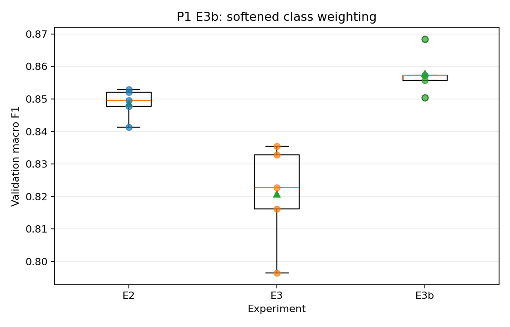

# P1 E3b: 완화된 클래스 가중치

## 사전 등록

- 독립 변수: 클래스 가중치 공식
- E2: 일반 CE
- E3: `inverse_frequency`
- E3b: `sqrt_inverse_frequency`
- 고정 요소: 분할, 2채널 입력, 모델 구조와 나머지 학습 설정
- 학습 seed: 42, 52, 62, 72, 82
- 분할 SHA-256: `11fa5f986749f905e6b498b0a40bd4464c0575d6f73fa41215f6269b79f36090`
- 테스트 데이터 사용 여부: 사용하지 않음

## 검증 macro F1

| 실험 | 평균 ± 표준편차 | 최소–최대 |
|---|---:|---:|
| E2 | 0.8487 ± 0.0047 | 0.8413–0.8530 |
| E3 | 0.8208 ± 0.0156 | 0.7965–0.8355 |
| E3b | 0.8578 ± 0.0066 | 0.8504–0.8685 |

## 대응 차이

- E3b−E2 macro F1: +0.0091 ± 0.0078; 양수 seed 4/5
- E3b−E3 macro F1: +0.0371 ± 0.0155; 양수 seed 5/5
- E3b−E2 balanced accuracy: +0.0334 ± 0.0202; 양수 seed 5/5
- E3b−E2 `none` false positive: -180.6 ± 128.5; 감소 seed 5/5
- E3b−E3 `none` false positive: +178.2 ± 244.1; 감소 seed 1/5

## 클래스별 정밀도·재현율 변화

| 클래스 | E3b−E2 정밀도 | E3b−E2 재현율 | E3b−E3 정밀도 | E3b−E3 재현율 |
|---|---:|---:|---:|---:|
| Scratch | +0.0408 ± 0.0838; 양수 seed 2/5 | +0.0592 ± 0.0727; 양수 seed 4/5 | +0.1949 ± 0.1477; 양수 seed 4/5 | -0.0395 ± 0.1109; 양수 seed 3/5 |
| Loc | +0.0051 ± 0.1484; 양수 seed 3/5 | +0.0201 ± 0.1048; 양수 seed 4/5 | +0.2268 ± 0.0688; 양수 seed 5/5 | -0.0722 ± 0.0605; 양수 seed 1/5 |
| Edge-Loc | -0.0566 ± 0.0442; 양수 seed 0/5 | +0.0809 ± 0.0452; 양수 seed 5/5 | +0.1486 ± 0.1730; 양수 seed 4/5 | -0.0403 ± 0.1636; 양수 seed 1/5 |
| Donut | -0.0203 ± 0.0718; 양수 seed 2/5 | +0.0475 ± 0.0827; 양수 seed 4/5 | -0.0022 ± 0.0743; 양수 seed 2/5 | +0.0014 ± 0.0874; 양수 seed 2/5 |

## 판정 규칙

- E3b가 E3보다 정밀도 하락을 줄이면서 희소 클래스 재현율을 유지하는지 확인한다.
- macro F1 또는 정밀도가 크게 하락하면 단일 클래스 재현율 상승만으로 개선 판정하지 않는다.
- 평균 차이가 seed 변동보다 작거나 방향이 일관되지 않으면 우월성을 주장하지 않는다.

## 결론

- E3b−E3 macro F1: 평균 +0.0371, seed 간 표준편차 0.0155, 상승 5/5 seed. 평균 차이가 seed 간 표준편차를 넘고 방향도 모든 seed에서 일치한다. 고정 분할에서의 개선으로 판정한다.
- E3b−E2 macro F1: 평균 +0.0091, seed 간 표준편차 0.0078, 상승 4/5 seed. 평균 차이는 seed 간 표준편차를 넘지만 방향이 seed마다 갈린다. 일관된 차이로 판정하지 않는다.
- `none` false positive E3b−E2: 평균 180.6건 감소 (± 128.5), 감소 5/5 seed. 모든 seed에서 같은 방향이다.

### E3b−E3 클래스별 판정

- Scratch: 재현율 -0.0395 (하락 2/5 seed), 정밀도 +0.1949 (상승 4/5 seed). 재현율 상승과 정밀도 하락의 절충 패턴은 확인되지 않는다.
- Loc: 재현율 -0.0722 (하락 4/5 seed), 정밀도 +0.2268 (상승 5/5 seed). 재현율 상승과 정밀도 하락의 절충 패턴은 확인되지 않는다. 다만 정밀도는 모든 seed에서 같은 방향이다.
- Edge-Loc: 재현율 -0.0403 (하락 4/5 seed), 정밀도 +0.1486 (상승 4/5 seed). 재현율 상승과 정밀도 하락의 절충 패턴은 확인되지 않는다.
- Donut: 재현율 +0.0014 (상승 2/5 seed), 정밀도 -0.0022 (하락 3/5 seed). 재현율 상승과 정밀도 하락의 절충 패턴은 확인되지 않는다.

### E3b−E2 클래스별 판정

- Scratch: 재현율 +0.0592 (상승 4/5 seed), 정밀도 +0.0408 (상승 2/5 seed). 재현율 상승과 정밀도 하락의 절충 패턴은 확인되지 않는다.
- Loc: 재현율 +0.0201 (상승 4/5 seed), 정밀도 +0.0051 (상승 3/5 seed). 재현율 상승과 정밀도 하락의 절충 패턴은 확인되지 않는다.
- Edge-Loc: 재현율 +0.0809 (상승 5/5 seed), 정밀도 -0.0566 (하락 5/5 seed). 재현율 상승과 정밀도 하락이 모든 seed에서 반복됐다.
- Donut: 재현율 +0.0475 (상승 4/5 seed), 정밀도 -0.0203 (하락 3/5 seed). 재현율 상승과 정밀도 하락이 3/5 seed에서 함께 나타났으나 모든 seed에서 일치하지는 않는다.

## 다음 결정

E3b를 현재 P1의 선도 후보로 유지한다. 테스트 데이터는 갱신하지 않는다. Edge-Loc 정밀도와 희소 클래스 재현율의 추가 균형이 필요하면 다음 실험으로 가중치 상한을 사전 고정한 E3c를 비교한다.
