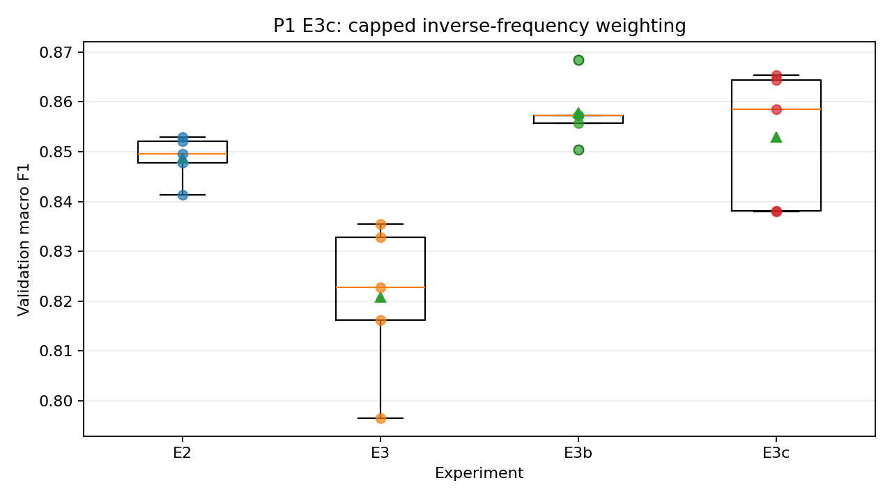

# P1 E3c: 역빈도 가중치 상한

## 사전 등록

- 독립 변수: 역빈도 클래스 가중치 상한 `max_min_ratio=32.0`
- 선정 근거: E3b의 약 32.23:1 동적 범위와 맞춘 사전 고정값
- E3b는 전체 가중치 분포를 제곱근으로 완화하고 E3c는 희소 클래스 꼬리만 제한한다.
- 학습 seed: 42, 52, 62, 72, 82
- 분할 SHA-256: `11fa5f986749f905e6b498b0a40bd4464c0575d6f73fa41215f6269b79f36090`
- 테스트 데이터 사용 여부: 사용하지 않음

## 검증 macro F1

| 실험 | 평균 ± 표준편차 | 최소–최대 |
|---|---:|---:|
| E2 | 0.8487 ± 0.0047 | 0.8413–0.8530 |
| E3 | 0.8208 ± 0.0156 | 0.7965–0.8355 |
| E3b | 0.8578 ± 0.0066 | 0.8504–0.8685 |
| E3c | 0.8529 ± 0.0138 | 0.8380–0.8654 |

## 대응 차이

- E3c−E2 macro F1: +0.0041 ± 0.0152; 양수 seed 3/5
- E3c−E2 balanced accuracy: +0.0390 ± 0.0382; 양수 seed 4/5
- E3c−E2 `none` false positive: -285.0 ± 149.8; 감소 seed 5/5
- E3c−E3 macro F1: +0.0321 ± 0.0130; 양수 seed 5/5
- E3c−E3 balanced accuracy: -0.0063 ± 0.0127; 양수 seed 2/5
- E3c−E3 `none` false positive: +73.8 ± 194.6; 감소 seed 2/5
- E3c−E3b macro F1: -0.0050 ± 0.0113; 양수 seed 2/5
- E3c−E3b balanced accuracy: +0.0057 ± 0.0278; 양수 seed 3/5
- E3c−E3b `none` false positive: -104.4 ± 165.2; 감소 seed 4/5

## 클래스별 정밀도·재현율 변화

| 비교 | 클래스 | 정밀도 변화 | 재현율 변화 |
|---|---|---:|---:|
| E3c−E2 | Scratch | +0.0012 ± 0.0739; 양수 seed 2/5 | +0.0592 ± 0.0508; 양수 seed 5/5 |
| E3c−E2 | Loc | -0.0771 ± 0.0708; 양수 seed 0/5 | +0.0694 ± 0.0757; 양수 seed 4/5 |
| E3c−E2 | Edge-Loc | -0.1504 ± 0.0708; 양수 seed 0/5 | +0.1711 ± 0.0539; 양수 seed 5/5 |
| E3c−E2 | Donut | +0.0015 ± 0.1285; 양수 seed 2/5 | +0.0230 ± 0.1229; 양수 seed 2/5 |
| E3c−E3 | Scratch | +0.1553 ± 0.0715; 양수 seed 5/5 | -0.0395 ± 0.0516; 양수 seed 1/5 |
| E3c−E3 | Loc | +0.1446 ± 0.1012; 양수 seed 4/5 | -0.0229 ± 0.0712; 양수 seed 2/5 |
| E3c−E3 | Edge-Loc | +0.0548 ± 0.1752; 양수 seed 3/5 | +0.0500 ± 0.1535; 양수 seed 3/5 |
| E3c−E3 | Donut | +0.0196 ± 0.1263; 양수 seed 3/5 | -0.0230 ± 0.1032; 양수 seed 1/5 |
| E3c−E3b | Scratch | -0.0396 ± 0.1367; 양수 seed 2/5 | +0.0000 ± 0.0997; 양수 seed 1/5 |
| E3c−E3b | Loc | -0.0822 ± 0.1455; 양수 seed 1/5 | +0.0493 ± 0.0913; 양수 seed 3/5 |
| E3c−E3b | Edge-Loc | -0.0938 ± 0.0915; 양수 seed 0/5 | +0.0902 ± 0.0472; 양수 seed 5/5 |
| E3c−E3b | Donut | +0.0218 ± 0.0589; 양수 seed 3/5 | -0.0245 ± 0.0497; 양수 seed 1/5 |

## 판정 규칙

- E3c가 E3b보다 macro F1을 유지하면서 Loc·Edge-Loc 재현율을 개선하는지 확인한다.
- 정밀도 또는 macro F1이 크게 하락하면 재현율 상승만으로 개선 판정하지 않는다.
- 평균 차이가 seed 변동보다 작거나 방향이 일관되지 않으면 우월성을 주장하지 않는다.

## 결론

- E3c−E3 macro F1: 평균 +0.0321, seed 간 표준편차 0.0130, 상승 5/5 seed. 평균 차이가 seed 간 표준편차를 넘고 방향도 모든 seed에서 일치한다. 고정 분할에서의 개선으로 판정한다.
- E3c−E3b macro F1: 평균 -0.0050, seed 간 표준편차 0.0113, 상승 2/5 seed. 평균 차이가 seed 간 표준편차를 넘지 않고 방향도 seed마다 갈린다. 일관된 차이로 판정하지 않는다.
- Edge-Loc (E3c−E3b): 재현율 +0.0902 (상승 5/5 seed), 정밀도 -0.0938 (하락 5/5 seed). 재현율 상승과 정밀도 하락이 모든 seed에서 반복됐다.
- E3b는 E3c보다 macro F1 평균이 높고(0.8578 vs 0.8529) 표준편차도 더 작다(0.0066 vs 0.0138). 사전 주 지표인 macro F1을 기준으로 E3b를 선도 후보로 둔다.

## P1 정지 결정

P1의 목표였던 강한 역빈도 가중치 완화 방법을 E3b와 E3c로 비교했고 E3b가 더 안정적인 절충임을 확인했다. E4~E6은 선택적 확장 실험으로 남기며, 검증 데이터에 대한 반복 조정을 피하기 위해 현재 P1을 종료한다. 테스트 데이터는 갱신하지 않는다.
