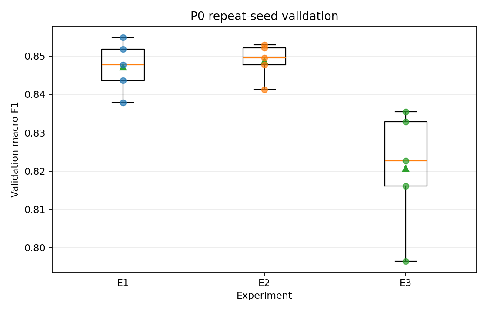

# P0 반복 seed 재검증

## 실험 질문과 사전 해석 규칙

1. E2−E1의 macro F1 차이가 학습 seed 변동을 넘어 일관되는가?
2. E3의 희소 클래스 재현율 상승과 정밀도 하락이 여러 seed에서 반복되는가?

n=5이므로 평균 차이가 seed 간 표준편차보다 작거나 방향이 일관되지 않으면 우월성을 주장하지 않는다. 이 보고서는 검증 데이터만 사용한다.

## 실행 조건

- 학습 seed: 42, 52, 62, 72, 82
- 고정 분할 SHA-256: `11fa5f986749f905e6b498b0a40bd4464c0575d6f73fa41215f6269b79f36090`
- 고정 요소: 분할, 모델 구조, 손실, optimizer, 학습률, weight decay, batch size, 최대 epoch, 조기 종료 기준, 입력 크기

## 검증 macro F1

| 실험 | 평균 ± 표준편차 (최소–최대; 중앙값) |
|---|---:|
| E1 | 0.8472 ± 0.0067 (0.8379–0.8549; median 0.8478) |
| E2 | 0.8487 ± 0.0047 (0.8413–0.8530; median 0.8496) |
| E3 | 0.8208 ± 0.0156 (0.7965–0.8355; median 0.8227) |

## 대응 비교

- E2−E1 macro F1: 0.0015 ± 0.0024 (-0.0020–0.0040; median 0.0018); 양수 seed 4/5
- E3−E2 macro F1: -0.0280 ± 0.0191 (-0.0565–-0.0084; median -0.0250); 양수 seed 0/5

## E3−E2 클래스별 정밀도·재현율 변화

| 클래스 | 정밀도 변화 | 정밀도 상승 | 재현율 변화 | 재현율 상승 |
|---|---:|---:|---:|---:|
| Scratch | -0.1542 ± 0.1197 | 0/5 | +0.0987 ± 0.0628 | 5/5 |
| Loc | -0.2217 ± 0.0847 | 0/5 | +0.0923 ± 0.1002 | 4/5 |
| Edge-Loc | -0.2052 ± 0.1383 | 0/5 | +0.1212 ± 0.1881 | 4/5 |
| Donut | -0.0181 ± 0.0558 | 2/5 | +0.0460 ± 0.0633 | 3/5 |

- `none` false positive E3−E2: 평균 358.8건 감소 (± 299.1), 감소 4/5 seed. 방향이 seed마다 갈린다.

## 실행 상태

- 완료: 15/15
- 조기 종료: 15/15
- 실패 실행은 집계 전에 오류로 중단되므로 이 보고서에 누락된 채 반영될 수 없다.

## 판정

- E2−E1 macro F1: 평균 +0.0015, seed 간 표준편차 0.0024, 상승 4/5 seed. 평균 차이가 seed 간 표준편차를 넘지 않고 방향도 seed마다 갈린다. 일관된 차이로 판정하지 않는다.
- E3−E2 macro F1: 평균 -0.0280, seed 간 표준편차 0.0191, 상승 0/5 seed. 평균 차이가 seed 간 표준편차를 넘고 방향도 모든 seed에서 일치한다. 고정 분할에서의 하락으로 판정한다.

### E3−E2 클래스별 판정

- Scratch: 재현율 +0.0987 (상승 5/5 seed), 정밀도 -0.1542 (하락 5/5 seed). 재현율 상승과 정밀도 하락이 모든 seed에서 반복됐다.
- Loc: 재현율 +0.0923 (상승 4/5 seed), 정밀도 -0.2217 (하락 5/5 seed). 재현율 상승과 정밀도 하락이 4/5 seed에서 함께 나타났으나 모든 seed에서 일치하지는 않는다.
- Edge-Loc: 재현율 +0.1212 (상승 4/5 seed), 정밀도 -0.2052 (하락 5/5 seed). 재현율 상승과 정밀도 하락이 4/5 seed에서 함께 나타났으나 모든 seed에서 일치하지는 않는다.
- Donut: 재현율 +0.0460 (상승 3/5 seed), 정밀도 -0.0181 (하락 3/5 seed). 재현율 상승과 정밀도 하락의 절충 패턴은 확인되지 않는다.

### 주장할 수 없는 것

- E2 입력 표현의 일반적인 우월성
- E3가 전체적으로 더 좋은 모델이라는 주장
- 검증 반복 결과에 근거한 테스트 또는 운영 환경 성능 개선

## 다음 결정

P1에 진입한다. 첫 비교는 E3b `sqrt(inverse_frequency)` 가중치이며, E2·E3와 같은 분할·5개 seed를 사용해 정밀도 하락을 줄이면서 희소 클래스 재현율을 유지하는지 검증한다. 테스트 데이터는 사용하지 않는다.
